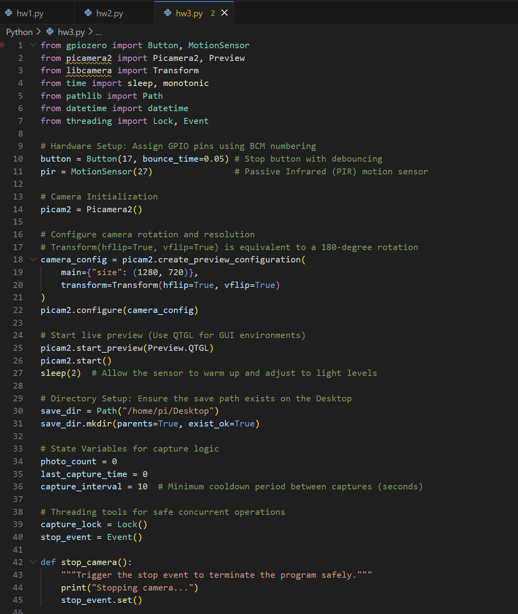
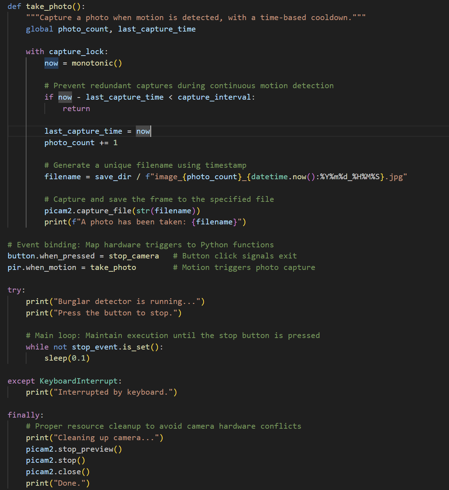
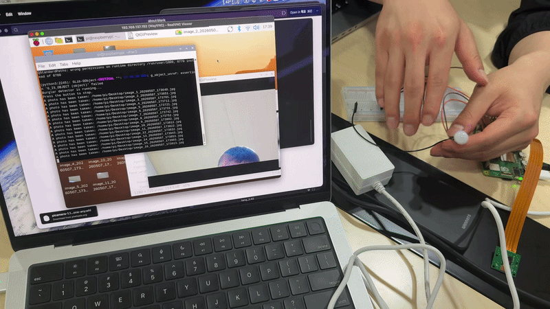

# IoT26-HW03: Control Raspberry Pi Digital Outputs with Python (LED)

## 1. Project Overview
- This project focuses on integrating a PIR (Passive Infrared) motion sensor with a Raspberry Pi Camera Module. The system is designed to detect physical movement in its surroundings and automatically trigger a photo capture event. By utilizing the gpiozero and picamera2 libraries, I implemented an automated monitoring system that bridge hardware sensing with digital imaging.
## 2. Execution Screenshots
- screenshot of the IDE



## 3. Working Video
- GIF Preview:


## 4. Main Source Code
```python
from gpiozero import Button, MotionSensor
from picamera2 import Picamera2, Preview
from libcamera import Transform
from time import sleep, monotonic
from pathlib import Path
from datetime import datetime
from threading import Lock, Event

# Hardware Setup: Assign GPIO pins using BCM numbering
button = Button(17, bounce_time=0.05) # Stop button with debouncing
pir = MotionSensor(27)                # Passive Infrared (PIR) motion sensor

# Camera Initialization
picam2 = Picamera2()

# Configure camera rotation and resolution
# Transform(hflip=True, vflip=True) is equivalent to a 180-degree rotation
camera_config = picam2.create_preview_configuration(
    main={"size": (1280, 720)},
    transform=Transform(hflip=True, vflip=True)
)
picam2.configure(camera_config)

# Start live preview (Use QTGL for GUI environments)
picam2.start_preview(Preview.QTGL)
picam2.start()
sleep(2)  # Allow the sensor to warm up and adjust to light levels

# Directory Setup: Ensure the save path exists on the Desktop
save_dir = Path("/home/pi/Desktop")
save_dir.mkdir(parents=True, exist_ok=True)

# State Variables for capture logic
photo_count = 0
last_capture_time = 0
capture_interval = 10  # Minimum cooldown period between captures (seconds)

# Threading tools for safe concurrent operations
capture_lock = Lock()
stop_event = Event()

def stop_camera():
    """Trigger the stop event to terminate the program safely."""
    print("Stopping camera...")
    stop_event.set()

def take_photo():
    """Capture a photo when motion is detected, with a time-based cooldown."""
    global photo_count, last_capture_time

    with capture_lock:
        now = monotonic()

        # Prevent redundant captures during continuous motion detection
        if now - last_capture_time < capture_interval:
            return

        last_capture_time = now
        photo_count += 1

        # Generate a unique filename using timestamp
        filename = save_dir / f"image_{photo_count}_{datetime.now():%Y%m%d_%H%M%S}.jpg"

        # Capture and save the frame to the specified file
        picam2.capture_file(str(filename))
        print(f"A photo has been taken: {filename}")

# Event binding: Map hardware triggers to Python functions
button.when_pressed = stop_camera   # Button click signals exit
pir.when_motion = take_photo        # Motion triggers photo capture

try:
    print("Burglar detector is running...")
    print("Press the button to stop.")

    # Main loop: Maintain execution until the stop button is pressed
    while not stop_event.is_set():
        sleep(0.1)

except KeyboardInterrupt:
    print("Interrupted by keyboard.")

finally:
    # Proper resource cleanup to avoid camera hardware conflicts
    print("Cleaning up camera...")
    picam2.stop_preview()
    picam2.stop()
    picam2.close()
    print("Done.")
